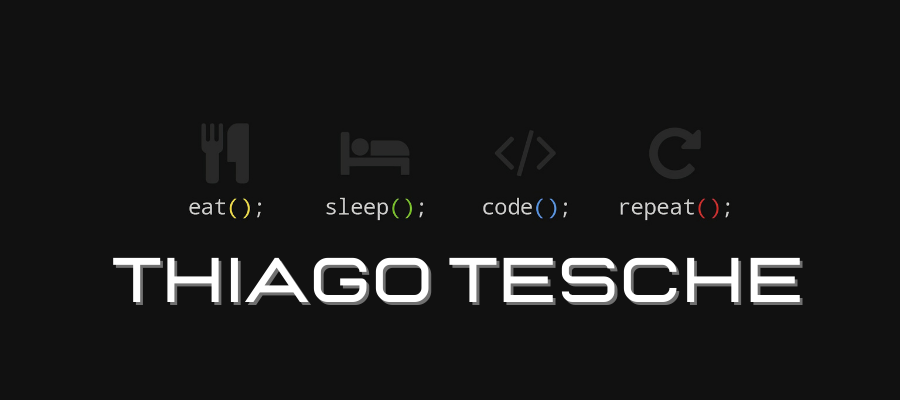

Um jovem apaixonado por tecnologia.

# Contato 📱 

 : thiagotesche@gmail.com

 

# Sobre mim

* 👩‍💻 Quero ser Desenvolvedor Front-End
* 👨‍🎓 Cursando Análise e Desenvolvimento de Sistemas na Faculdade Descomplica
* 🤸 Capoeirista
* ✍️ Estudando Inglês na Educart linguagens e tecnologias
* 🤟 Gosto de me comunicar em Libras.
* 🐾 Tenhos vários animais
* 🐇 incluindo uma Coelha MiniLop

### Hobbies

* 🎮 videogames
* 📖 ler livros
* 🛋️ Assistir séries

### Linguagens and frameworks

     

 

# Stats

 

# Melhores repositórios

 

 

 

 

 

 

